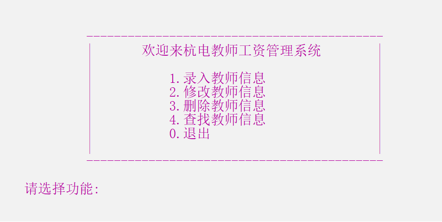

# 教师工资管理系统

> 一个简单系统，适合基础学习

## :star:1. 展示



## :star:2. 函数清单及说明

```c
int MainMenu ();    //开始主菜单 

struct Teacher *ExtractTeacherOfFile();  //初始化链表（从文件提取数据）

void ModifyTeacherInformation (struct Teacher *pHead);   //信息修改 

void AddTeacherInformation (struct Teacher *pHead);    //信息录入 

int IdIsExist (struct Teacher *pHead, int id);   //判断教师号是否重复 

void ShowTeacherInformation (struct Teacher *p);    //展示教师信息 

void DeleteTeacherInformation (struct Teacher *pHead);   //信息删除 

void SearchMenu (struct Teacher *pHead);        //信息查找主菜单 

void SearchTeacherById (struct Teacher *pHead);      //教师号查找 

void SearchTeacherByName (struct Teacher *pHead);     //姓名查找 

void ShowAllTeachers (struct Teacher *pHead);    //查看所有教师信息 

void ReserveTeacherInformation (struct Teacher *pHead);  //保存信息，退出系统 
```

 

## :star:3. 函数调用关系说明

:sparkles:A. 主菜单--`int MainMenu()`

```c
struct Teacher *ExtractTeacherOfFile()  //从文件提取教师数据

void AddTeacherInformation(struct Teacher *pHead)

void DeleteTeacherInformation(struct Teacher *pHead)

void ModifyTeacherInformation(struct Teacher *pHead)

void SearchMenu(struct Teacher *pHead)

void ReserveTeacherInformation(struct Teacher *pHead) 
```

 

:sparkles:B. 录入教师信息--`void AddTeacherInformation(struct Teacher *pHead)`

```c
int IdIsExist(struct Teacher* pHead, int id) //判断教师号是否存在
```

 

:sparkles:C. 删除教师信息--`void DeleteTeacherInformation(struct Teacher *pHead)` 

```c
ShowTeacherInformation(struct Teacher *ptem)//展示当前教师信息
```

 

:sparkles:D. 修改教师信息--`void ModifyTeacherInformation(struct Teacher *pHead)`

```c
ShowTeacherInformation(struct Teacher *ptem)
```

 

:sparkles:E. 查找教师信息--`void SearchMenu(struct Teacher *pHead)`

```c
void ShowTeacherInformation(struct Teacher *ptem) 

void SearchTeacherById(struct Teacher *pHead)  //教师号查询

void SearchTeacherByName(struct Teacher *pHead) //名字查询

void ShowAllTeachers(struct Teacher *pHead)   //查看所有教师信息
```

 

:sparkles:F. 退出--`void ReserveTeacherInformation(struct Teacher *pHead)` 
